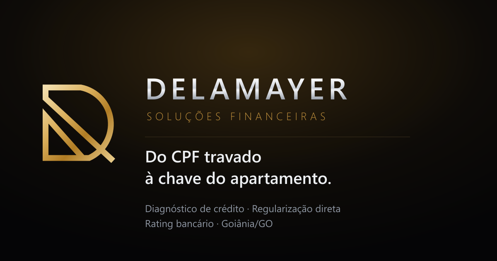

<div align="center">



<br>

**Landing page da [Delamayer Soluções Financeiras](https://delamayer.com.br)** — Setor Oeste, Goiânia/GO

Um site de assessoria de crédito que se recusa a fazer as promessas
que o setor inteiro faz — e transforma essa recusa no argumento de venda.

<br>

[](https://react.dev)
[](https://www.typescriptlang.org)
[](https://vite.dev)
[](https://tailwindcss.com)
[](https://threejs.org)
[](https://gsap.com)
[](https://biomejs.dev)
[](https://playwright.dev)

</div>

---

## O problema

A Delamayer é uma assessoria de crédito de Goiânia. O mercado dela é um dos
mais desconfiados que existem, e por um motivo justo: quem procura "limpar o
nome" já foi bombardeado por anúncios prometendo **"CPF limpo em 7 dias"**,
**"100% de aprovação"** e **"blindagem jurídica"** — coisas que, quando não são
impossíveis, são propaganda enganosa nos termos do Código de Defesa do
Consumidor.

A empresa tinha Instagram, um Linktree e uma entrevista em TV aberta. Não tinha
site. E tinha um diferencial real que nenhum concorrente sabia explicar:

> **Score e rating bancário são coisas diferentes.**
> O score é do birô, vai de 0 a 1.000 e vale para o mercado inteiro.
> O rating é interno do banco, vai de A a F, e mede só o seu relacionamento com
> ele. É por isso que dá para ter 800 pontos no Serasa e ouvir "não" no
> financiamento.

O briefing técnico era o mesmo de sempre: **custo operacional próximo de zero**.
Nada de servidor, nada de banco de dados, nada de mensalidade de plataforma.

---

## A decisão que organizou o resto

Num setor onde todo mundo promete, **a única coisa que ninguém pode copiar é
recusar-se a prometer.** Um concorrente não consegue publicar "não damos prazo
fechado" sem contradizer o próprio anúncio.

Isso deixou de ser uma escolha de copy e virou uma restrição de engenharia:

**1. Uma seção inteira chamada "O que a gente não faz."** Três promessas que o
visitante vai encontrar por aí e não vai encontrar aqui, com a explicação
técnica de por que cada uma é impossível de cumprir.

**2. Nenhum número sem fonte.** As estatísticas vivem em `EVIDENCIAS`, em
[`src/lib/business.ts`](src/lib/business.ts), cada uma com `fonte` e `url`. A
atribuição é impressa na tela, na mesma altura do olho — não como letra miúda.

**3. Um teste que bloqueia propaganda enganosa.**

```ts
// tests/unit/diagnostico.test.ts
const PROMESSAS_PROIBIDAS = [
  /\bgarant(imos|ido|ia|e)\b/i,
  /\b100%\s*(de\s*)?(aprova|sucesso|garant)/i,
  /\bem at[ée]\s+\d+\s*(dias|horas|semanas)/i,
  /\bapagamos\b/i,
  /\bblindagem jur[ií]dica\b/i,
]
```

O teste percorre as **288 combinações possíveis** de resposta do diagnóstico e
falha se qualquer uma produzir um desses termos. Se alguém, um dia, "melhorar" o
texto e escrever "garantimos", o CI barra antes do deploy.

Não é sobre censurar palavra. É sobre obrigar quem escrever a passar por ali e
decidir conscientemente, em vez de escorregar.

---

## O que ficou diferente

### 🥇 O logotipo virou geometria — e ela alimenta o favicon, o SVG e o 3D

Só existia da marca um PNG rasterizado. O monograma normalmente viraria três
arquivos a partir dele: um `.ico`, um `.svg` e um `.glb`. Aqui ele é **uma
descrição numérica em [`src/lib/mark.ts`](src/lib/mark.ts)**, e dela saem os
três.

Os números não foram estimados no olho. O arquivo original foi binarizado numa
grade de 78×80 e cada vértice lido dali; a barriga do "D" é o círculo
circunscrito aos três pontos medidos (topo, extremo direito e base); e a
espessura veio de medir a largura da haste esquerda — 42,5 px numa renderização
de 600 px, o que dá **9,07 unidades** na caixa do desenho.

O desenho revelado por essa leitura foi uma surpresa: não é um contorno
preenchido, é **um traço monolinear único e contínuo** que percorre a diagonal,
a haste, o topo, a barriga, a base, a haste inferior e a segunda diagonal — e
que se cruza consigo mesmo embaixo à direita.

```ts
export function markCenterline(): string   // → favicon, <Mark>, imagem de OG
export function markOutline(): Contorno[]  // → THREE.Shape, extrudado em ouro
```

O cruzamento é o detalhe caro. Um polígono auto-intersectante triangula errado —
o `ShapeGeometry` produz faces invertidas em vez de falhar. A saída foi calcular
as bordas do traço inteiro **antes** de cortá-lo em três pedaços: como pedaços
vizinhos compartilham exatamente os mesmos pontos de borda no corte, eles se
encaixam sem fenda e o resultado extrudado é indistinguível de uma peça única.
Há um teste só para isso.

O dia em que a espessura mudar, ela muda em um lugar. Com arquivos manuais,
cinco deles ficariam desatualizados e ninguém perceberia — favicon é a coisa que
menos se olha e mais se nota quando está errada.

### ✨ Ouro de verdade em WebGL, sem baixar um único byte de terceiro

Metal cromado sem *environment map* é cinza chapado. Ouro sem *environment map*
é amarelo chapado. O que dá a leitura de "polido" são as faixas de luz
refletidas.

A solução usual é baixar um `.hdr` de estúdio — 2 a 8 MB, hospedado num CDN de
terceiro. Aqui o ambiente é **montado em código**: retângulos emissivos
posicionados como softboxes, cozidos uma única vez num cubemap pelo
`PMREMGenerator`.

```ts
// src/components/BrandScene.tsx
const SOFTBOXES = [
  { position: [0, 3.2, 4.2],   scale: [11, 4.5], intensity: 11, color: '#fff4dd' }, // key
  { position: [-4.5, 1.2, -4], scale: [7, 7],    intensity: 8,  color: '#ffd489' }, // rim quente
  { position: [5, -1.4, 2],    scale: [6, 4],    intensity: 5,  color: '#cfe0f5' }, // kicker frio
  { position: [1.5, 4, -1],    scale: [0.35, 9], intensity: 16, color: '#ffffff' }, // o "risco"
  // …mais quatro de preenchimento, por trás e por baixo
]
```

As intensidades são **muito mais altas do que a intuição sugere**, e isso custou
uma iteração: a primeira versão usava ~1 no preenchimento e o monograma saiu
parecendo um contorno vazado. Metal com `metalness: 1` não tem cor própria, só
reflexo — e sobre fundo preto, um reflexo fraco é indistinguível de reflexo
nenhum. A correção foi triplicar o preenchimento, clarear o degradê do "céu",
baixar o `metalness` para 0,88 (a fração de difusa que sobra garante que a peça
seja dourada mesmo no pior ângulo) e espalhar o reflexo com mais desfoque no
`PMREMGenerator`.

O `@react-three/drei` foi deixado de fora de propósito: resolveria ambiente,
flutuação e sombra de contato, mas traz junto os loaders de HDRI e gainmap que
este site nunca usa — ~250 kB de JS para três efeitos que couberam em 80 linhas.

**A cena nem existe no celular.** `useIsDesktop` decide antes do `React.lazy`,
então o import dinâmico sequer é disparado — um objeto com *pointer-follow* não
tem o que seguir num aparelho sem ponteiro, e a conta de bateria é real.

### 🎯 Um diagnóstico que roda inteiro no navegador

Cinco perguntas, uma leitura, uma mensagem de WhatsApp com o caso já descrito —
em vez de um "oi" que custa dez mensagens para virar contexto.

A triagem aplica a mesma prioridade clínica do atendimento real: **restrição
ativa domina qualquer outro sinal**, porque nada mais se resolve enquanto ela
existe. Só depois vale a pena perguntar se o problema é rating.

```ts
// src/lib/diagnostico.ts — o caso assinatura da marca
if (r.recusa === 'sim' && (r.score === 'alto' || r.score === 'medio')) {
  return { id: 'rating', titulo: 'O score não é o que está te reprovando', … }
}
```

**Nada é enviado a lugar nenhum.** Não há formulário, não há captura de e-mail,
não há servidor. O resultado é calculado no navegador e vira texto que *a pessoa*
decide enviar — e isso é dito na tela, porque num site sobre dívida a primeira
pergunta silenciosa de quem responde é "onde isso vai parar".

### 📊 Um mostrador de rating amarrado à rolagem

Ler "o rating vai de A a F" é abstrato. Ver o ponteiro subir de F para A
conforme você rola, com a nota trocando embaixo — "C, risco moderado: aprovado
com taxa média e limite curto" — é concreto.

É SVG, não WebGL, e a escolha tem motivo: um arco com um ponteiro é geometria
2D. Em WebGL custaria um segundo contexto de render vivo na mesma página do
herói, e ficaria com a borda serrilhada — que é justamente o que o SVG resolve
de graça em qualquer densidade de tela.

O ângulo é controlado por `scrub`, e não por `duration`: assim a pessoa pode
subir e o ponteiro volta. Uma animação disparada por gatilho rodaria uma vez e
ficaria travada no fim.

### 📄 HTML estático por rota, gerado no build

O site é uma SPA, mas `/diagnostico`, `/rating` e `/imovel` são destino de
anúncio e de link colado no Instagram. Sem tratamento, as três seriam servidas
com o `<head>` da home — mesmo título, mesma description, mesma canonical.

Um plugin do Vite reescreve o `<head>` de cada rota em tempo de build:

```
dist/index.html                        ← home
dist/diagnostico/index.html            ← título, description, canonical e JSON-LD próprios
dist/rating/index.html                 ← + FAQPage só com as perguntas de rating
dist/imovel/index.html                 ← + FAQPage só com as perguntas de imóvel
dist/404.html                          ← noindex, servido com status 404 de verdade
dist/sitemap.xml                       ← lastmod vindo do último commit, não do relógio
dist/llms.txt                          ← o site descrito para assistentes de IA
```

Uma regra atravessa o `seo.ts`: **um nó de dado estruturado só é emitido na rota
que mostra aquele conteúdo.** Declarar `FAQPage` numa página sem FAQ é violação
explícita das diretrizes do Google, e o custo não é teórico — é a página perder
a elegibilidade a resultado rico. Há teste para isso.

O `lastmod` do sitemap vem do último commit, e não da data do build. Um redeploy
sem mudança nenhuma marcaria todas as páginas como alteradas hoje, e um sitemap
que diz isso toda semana é um sitemap que o Google aprende a desconsiderar.

### 🤖 llms.txt — porque cada vez mais gente pergunta a um assistente

```
## O que a empresa NÃO faz

- Não apaga dívida legítima. Dívida existente é negociada com o credor…
- Não garante prazo fechado: depois do acordo, o prazo de baixa depende…
- Não cobra pelo que é gratuito. A consulta ao Serasa e o Registrato…
```

O arquivo é gerado do mesmo `business.ts` que alimenta a página. A seção de
limites é o motivo de ele existir: um assistente que resumisse o site sem ela
produziria exatamente a promessa que a Delamayer se recusa a fazer — com a
autoridade de estar citando a fonte oficial.

### 🔒 Mapa e vídeo só depois do clique

Um iframe do YouTube custa ~700 kB e planta cookies em três domínios do Google
antes de alguém pedir. Um iframe do Google Maps custa ~900 kB.

Os dois nascem como capa clicável. Até o clique, **nenhuma requisição sai daqui
para eles** — e há um teste de Playwright que percorre a home inteira, dispara
todos os `IntersectionObserver` e falha se qualquer um dos dois for requisitado.

### ⚖️ O orçamento de peso é verificado no CI

```
Caminho crítico: 144 kB gzip (limite 170 kB)
```

O limite é sobre o que o navegador baixa **antes do primeiro paint**. O chunk do
three.js (235 kB gzip) fica de fora porque é buscado sob demanda, depois de a
página estar interativa — e nunca no celular.

Ele existe para pegar a regressão silenciosa: alguém importa uma biblioteca de
ícones inteira por causa de um ícone, o bundle dobra, e ninguém percebe até a
conta do anúncio piorar.

---

## Movimento

O site é cheio de animação. Três regras impedem que isso vire um problema:

**1. Estado escondido nunca sobrevive a uma falha.**
Toda animação de entrada parte de um estado invisível *apenas* quando uma classe
de "armado" está presente:

```css
/* src/index.css */
.hero-armed:not(.hero-ready) [data-hero-line] > span { transform: translateY(120%); }
```

Sem `hero-armed`, nada é escondido. Se o GSAP não carregar, se o
`IntersectionObserver` não existir, se a cena WebGL explodir — o `<h1>` continua
na tela. É a diferença entre um site com animação quebrada e um site em branco.

**2. `prefers-reduced-motion` desliga tudo que não é essencial.**
Preloader, cursor personalizado, cena 3D, parallax, rolagem horizontal e scroll
suave consultam a preferência **antes de montar**. Não é degradação — é um
caminho alternativo completo.

**3. Só `transform` e `opacity`.**
Quando a altura precisa animar, é `grid-template-rows: 0fr → 1fr` — a única
forma de transicionar até "altura do conteúdo" sem medir nada em JavaScript e
sem chutar um `max-height` que corta o texto quando ele cresce.

### O que é carregado sob demanda

| Recurso | Quando |
|---|---|
| `three.js` (~235 kB gz) | só desktop, sem movimento reduzido, depois do primeiro paint |
| `gsap` + `ScrollTrigger` (~45 kB gz) | só na home e em `/rating`, que têm animação de scroll |
| `lenis` (~5 kB gz) | só com ponteiro fino e sem movimento reduzido |
| `@sentry/react` | só se `VITE_SENTRY_DSN` existir |
| `web-vitals` | no primeiro `requestIdleCallback` |
| iframe do mapa e do vídeo | só depois do clique |

---

## Qualidade

| Ferramenta | Papel |
|---|---|
| **Biome** | lint + formatação, um binário no lugar de ESLint + Prettier |
| **TypeScript** | `strict`, `noUnusedLocals`, `erasableSyntaxOnly` |
| **Knip** | dependência, export e arquivo órfãos |
| **Vitest** | 64 testes de lógica pura, cobertura mínima de 85% em `src/lib` |
| **Playwright** | 70 testes contra o **build de produção**, em desktop e celular |
| **commitlint + lefthook** | Conventional Commits, lint no `pre-commit`, testes no `pre-push` |
| **Sentry** *(opcional)* | erro de JavaScript em campo, desligado por padrão |
| **Web Vitals** | LCP, CLS e INP medidos no aparelho de quem visita |

<details>
<summary><b>Observabilidade num site que não tem servidor</b></summary>

<br>

O instinto num projeto assim é montar a pilha inteira de APM. Aqui ela não tem o
que medir: existe um bundle estático servido por uma CDN e nada mais — não há
segundo salto para correlacionar, host para instrumentar nem latência de
back-end para atribuir. Traço distribuído sem serviço distribuído é cerimônia
sem sinal, e APM cobrado por host ou por sessão custaria mais do que toda a
infraestrutura junta num site cuja restrição dura é custo operacional zero.

Sobram dois problemas reais, e cada um tem uma ferramenta certa.

**Erro que ninguém reporta.** Um `TypeError` que só acontece num navegador
específico, numa tela específica. A pessoa fecha a aba, o negócio perde o lead e
ninguém fica sabendo. É o caso do **Sentry** — plano gratuito, carregado sob
import dinâmico e **só baixado se houver DSN configurado**. Sem a variável de
ambiente, nenhum byte de terceiro entra na página.

**Desempenho no aparelho real.** LCP, CLS e INP medidos em campo, e não num
laboratório com fibra. Num site que vive de tráfego de anúncio em celular ruim,
é essa a métrica que decide se o dinheiro do anúncio virou conversa. É o caso do
**Web Vitals** — 3 kB, carregado no primeiro `requestIdleCallback`.

Gravação de sessão fica **desligada de propósito**: este site pergunta sobre a
vida financeira de quem o acessa, e gravar a tela seria desproporcional ao que
se ganha em diagnóstico.

</details>

### Alguns testes que valem ser lidos

```ts
// A triagem cobre TODA combinação possível — sem `undefined`, sem caso esquecido.
it('devolve uma leitura completa para toda combinação', () => {
  for (const respostas of TODAS) { … }   // 3 × 3 × 2 × 4 × 4 = 288
})

// O horário é calculado no fuso de Goiânia, não no de quem visita.
it('nunca diz "aberto" num dia sem expediente', () => {
  // varre as 24 horas de sábado e domingo, de hora em hora
})

// O catálogo do JSON-LD NÃO declara preço, e isso é intencional.
it('não inventa preço para nenhum serviço', () => {
  expect(bruto).not.toMatch(/"price"/)
})

// Um `A` com raio negativo não dá erro no SVG — só desenha errado.
it('mantém o raio interno positivo em toda espessura usada na marca', () => { … })
```

O teste do horário, aliás, pegou um bug real na primeira execução:
`'08:00'.replace(':00', 'h')` devolvia **"08h"** — com o zero à esquerda, que
ninguém escreve em português. No selo do cabeçalho o texto é pequeno e a
diferença passaria batida por meses.

---

## Rodando localmente

```bash
npm install
npm run dev          # http://localhost:5173

npm run lint         # Biome
npx tsc -b           # tipos
npm run test         # Vitest
npm run knip         # código órfão
npm run check:dev    # o dev server sobe e resolve todo o grafo de imports
npm run build        # build de produção
npm run e2e          # Playwright (npm run e2e:install na primeira vez)
```

**Geração de assets** (só quando a marca ou as fontes mudam):

```bash
npm run brand        # favicon, ícones e imagem de OG, a partir de src/lib/mark.ts
npm run fonts        # baixa e auto-hospeda os subsets latin das fontes
```

---

## Estrutura

```
src/
├── lib/
│   ├── business.ts      ← TODO o conteúdo. Texto, horário, serviços, FAQ, evidências
│   ├── routes.ts        ← rotas e metadados (lido pelo React E pelo vite.config)
│   ├── seo.ts           ← JSON-LD e llms.txt, derivados de business.ts
│   ├── diagnostico.ts   ← a triagem. A única lógica de negócio do site
│   ├── mark.ts          ← a geometria do monograma (favicon + SVG + 3D)
│   ├── hours.ts         ← "aberto agora" no fuso de Goiânia
│   ├── analytics.ts     ← gtag, só se houver ID configurado
│   └── observability.ts ← Sentry e Web Vitals, ambos opcionais
├── components/          ← Mark, Logo, BrandScene, RatingDial, DiagnosticoTool, Cursor…
├── sections/            ← as onze seções da home, na ordem em que aparecem
└── pages/               ← /diagnostico, /rating, /imovel, privacidade, 404

scripts/
├── make-brand.mjs       ← gera os seis arquivos de marca a partir de mark.ts
├── fetch-fonts.mjs      ← auto-hospeda os subsets latin das fontes
└── check-dev.mjs        ← smoke test do dev server

tests/
├── unit/                ← Vitest: diagnóstico, horário, SEO, geometria da marca
└── e2e/                 ← Playwright: navegação, diagnóstico, acessibilidade
```

---

## Como contribuir

O fluxo é **Issue → branch → PR**, e nada entra na `main` direto. As regras
completas — incluindo as de conteúdo, que não se negociam — estão em
**[AGENTS.md](AGENTS.md)**. Elas valem para humanos e para agentes de IA; são as
mesmas.

---

## Licença

Código sob [MIT](LICENSE). A marca "Delamayer", o monograma e o conteúdo
textual sobre a empresa pertencem à Delamayer e não estão cobertos por ela.

<div align="center">
<br>

Feito por **[Felipe Neiva](https://github.com/ffneiva)**

</div>
